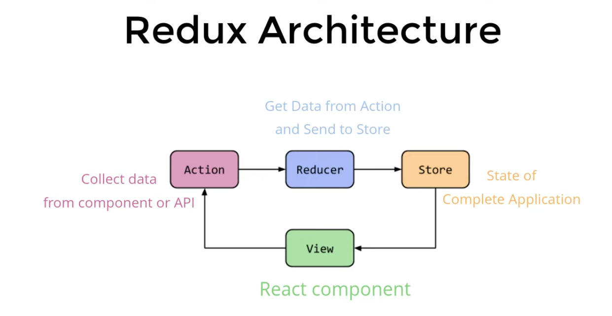

# REDUX AND REDUX TOOLKIT

A container where you can store your whole application data.

## What is Redux?

1. A pattern
2. A library
3. Independent of Frameworks
4. State Management with JS

## When to use Redux?

1. Big Applications
2. High frequency of state changes

### INSTALLATION:-

#### Redux:
```bash
npm install redux
```

#### Redux with react:
```bash
npm install react-redux
```




